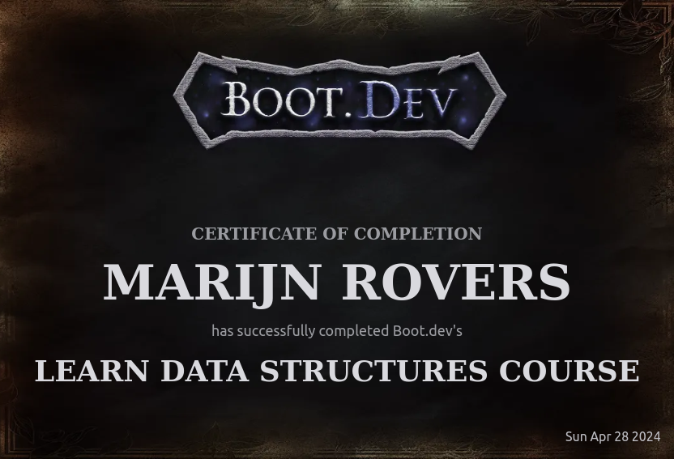

# Introduction

I am excited to announce that I have completed my course on data structures, which covered everything from algorithms to real-world applications. This course, offered by the boot.dev team, provided me with a comprehensive understanding of various data structures and their significance in software development.

## The Importance of Data Structures

Data structures are fundamental building blocks in computer science. They enable efficient storage, retrieval, and manipulation of data, making them essential for developing robust and scalable software applications.

By learning about data structures, I gained insights into:

- Arrays, linked lists, stacks, queues, trees, graphs, and more.
- The theoretical foundations and underlying principles of each data structure.
- Implementing data structures in code through hands-on exercises and real-world examples.

## Theory and Practice

What sets this course apart is its balanced approach between theory and practice. While we covered the theoretical aspects of data structures, the course also emphasized practical implementation. This combination helped solidify my understanding and provided me with the skills necessary to work effectively with data structures.

## Versatility and Applicability

One of the most significant takeaways from this course was realizing the versatility and applicability of data structures. They are not just academic concepts but are the backbone of many applications and technologies we use daily. Mastering data structures is an invaluable skill for any software developer.

## Next Steps: Building Software

Now that I have a solid foundation in algorithms and data structures, I am eager to apply my knowledge to real-world projects. I have been exploring projects from the Zenva Academy, which offers exciting opportunities to develop mobile apps and create interactive web experiences.

Collaborating with my friends, we are bouncing ideas off each other and pushing each other to grow. This collaborative environment allows us to turn our knowledge into tangible and meaningful software solutions.

## Friends and Discord Bot
In addition to my data structures course, I have also been fortunate to have the support of my friends in setting up a Discord bot. They have been instrumental in teaching me best practices and guiding me through the process of creating a functional and efficient bot. Their expertise and collaboration have been invaluable in my journey as a software developer.

## Conclusion

I highly recommend the boot.dev data structures course to anyone looking to level up their tech skills. It provides a comprehensive understanding of data structures, their implementation, and their real-world applications. With this knowledge, you can embark on a journey to build amazing software solutions.

Now, armed with a solid foundation in algorithms and data structures, I am ready to take on new challenges and create innovative software that makes a difference.
