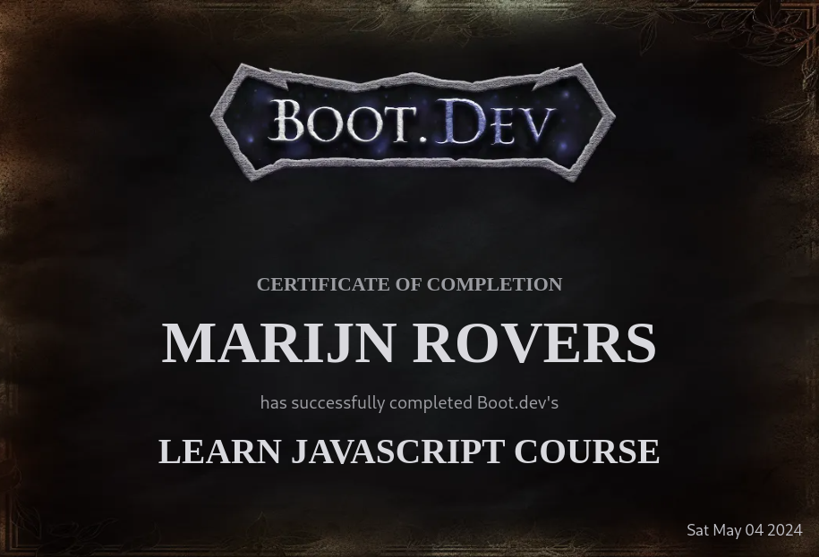

# Introduction

I am thrilled to announce that I have successfully completed the Introduction to JavaScript course. This course provided a comprehensive overview of JavaScript, covering everything from the fundamentals. It has equipped me with a solid foundation in JavaScript and its significance in software development.

## The Importance of JavaScript

JavaScript is a versatile programming language that powers the web, enabling dynamic and interactive web experiences. It is an essential skill for any web developer.

Throughout the course, I gained insights into the core syntax of JavaScript, its data types, functions, and object-oriented programming concepts.

## Theory and Practice

What sets this course apart is its balanced approach between theory and practice. While covering the theoretical aspects of JavaScript, the course also emphasized practical implementation. This combination helped solidify my understanding and provided me with the necessary skills to work effectively with JavaScript.

## Versatility and Applicability

One of the most significant takeaways from this course was realizing the versatility and applicability of JavaScript. It is not limited to web development but can also be used for server-side scripting, mobile app development, and even desktop applications. Mastering JavaScript opens up a world of possibilities for software development.

## Next Steps: Building Projects

Now that I have a solid foundation in JavaScript, I am eager to apply my knowledge to real-world projects. I am exploring projects from the boot.dev project gallery, which offers exciting opportunities to develop web applications and create innovative solutions.

## Conclusion

I highly recommend the Introduction to JavaScript course to anyone looking to kickstart their web development journey. It provides a comprehensive understanding of JavaScript, its implementation, and its real-world applications. With this knowledge, you can embark on a journey to build amazing web applications and create innovative solutions.

Now, armed with a solid foundation in JavaScript, I am ready to take on new challenges and create innovative software that makes a difference.
