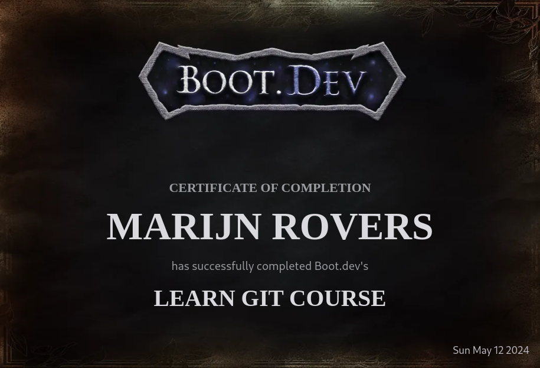

# Introduction

As an experienced developer, I thought I had a solid grasp of Git, the ubiquitous version control system. However, after completing the comprehensive boot.dev GIT certificate program, I was pleasantly surprised to discover a wealth of new knowledge and techniques that have significantly enhanced my Git workflow.

## Uncovering Hidden Gems in the boot.dev GIT Certificate

The boot.dev GIT certificate course delved deep into the intricacies of Git, covering not only the fundamental commands and concepts but also exploring advanced features and best practices. One of the standout lessons for me was the in-depth exploration of Git branching strategies. While I was already familiar with the basic branching workflow, the course introduced me to more sophisticated approaches, such as the Git Flow model, which has since become an integral part of my project management toolkit.

Additionally, the course covered essential Git maintenance tasks, such as cleaning up commit histories, managing large binary files, and navigating complex merge conflicts. These skills have proven invaluable in my day-to-day work, allowing me to maintain a clean and organized Git repository.

## Enhancing My Confidence and Productivity with the boot.dev GIT Certificate

The comprehensive nature of the boot.dev GIT certificate has not only expanded my technical knowledge but also boosted my confidence in using Git. I now feel more comfortable tackling complex Git-related challenges, whether it's collaborating with team members on a shared codebase or managing a project's version history.

Moreover, the skills I've acquired through the boot.dev GIT certificate have significantly improved my productivity. By streamlining my Git workflows and leveraging advanced features, I can now navigate my projects more efficiently, saving time and reducing the risk of costly mistakes.

## Conclusion

Overall, the boot.dev GIT certificate has been a game-changer for my Git proficiency. I highly recommend it to any developer, regardless of their current level of expertise, who seeks to take their Git skills to the next level. Now, with a deeper understanding and improved skills in Git, I am ready to tackle more complex projects and workflows.