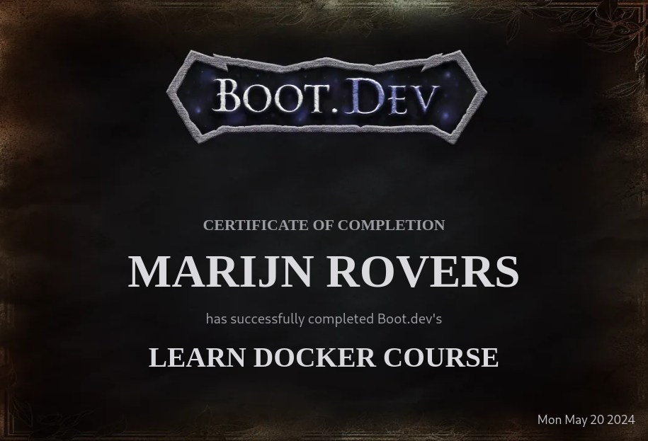

# Leveling Up My Docker Skills with the boot.dev Certificate

## Introduction

As a business professional, I recently completed the Introduction to Docker course offered by boot.dev. This transformative journey has allowed me to explore the world of Docker, a revolutionary container platform that has been reshaping the landscape of modern software development and deployment. I am excited to share my experience and delve deeper into the capabilities of Docker, particularly in the realms of Continuous Integration/Continuous Deployment (CI/CD) and Kubernetes.

## Docker: Simplifying Software Development and Deployment

At its core, Docker is a powerful tool that simplifies the process of building, deploying, and running applications in a consistent and reliable manner. By encapsulating an application and its dependencies within a standardized container, Docker eliminates the "it works on my machine" problem, ensuring that your software behaves the same way across different environments, from development to production.

## Streamlining the Deployment Process

One of the most compelling aspects of Docker is its ability to transform the deployment process, making it more efficient, reliable, and scalable. Let's take a closer look at the typical deployment process and how Docker can streamline it:

1. The developer writes some new code: As the driving force behind innovation, the developer's role is crucial in the software development lifecycle. With Docker, the developer can ensure that the application and its dependencies are packaged consistently, regardless of the underlying infrastructure.

2. The developer commits the code to Git: Version control systems, such as Git, play a vital role in managing code changes and collaborating with team members. When integrated with Docker, the development workflow becomes even more seamless, as the application's container image can be versioned and tracked alongside the codebase.

3. The developer pushes a new branch to GitHub: GitHub, a popular platform for hosting and collaborating on code repositories, serves as a central hub for managing the codebase. By pushing a new branch to GitHub, the developer initiates the next step in the deployment process.

4. The developer opens a pull request to the main branch: Pull requests allow team members to review and discuss the proposed changes before merging them into the main branch. This collaborative process ensures the quality and integrity of the codebase.

5. A teammate reviews the PR and approves it (if it looks good): The review process is a critical step in maintaining code quality and ensuring that the changes align with the project's requirements and standards.

6. The developer merges the pull request: Once the pull request is approved, the developer can merge the changes into the main branch, triggering the automated deployment process.

7. Upon merging, an automated script, perhaps a GitHub action, is started: Automation is a key aspect of modern software development, and Docker seamlessly integrates with tools like GitHub Actions to automate the build and deployment process.

8. The script builds the code (if it's a compiled language): For compiled languages, the automated script will build the application, ensuring that the latest code is ready for packaging into a Docker container.

9. The script builds a new Docker image with the latest program: The automated script will create a new Docker image that encapsulates the latest version of the application, including all its dependencies and runtime requirements.

10. The script pushes the new image to Docker Hub: Docker Hub, a cloud-based registry service, serves as a central repository for storing and sharing Docker images. By pushing the new image to Docker Hub, the deployment process can seamlessly integrate with various hosting platforms and infrastructure.

11. The server that runs the containers, perhaps a Kubernetes cluster, is told there is a new version: The final step in the deployment process involves notifying the hosting environment, such as a Kubernetes cluster, that a new version of the application is available.

12. The Kubernetes cluster pulls down the latest image: Upon receiving the update, the Kubernetes cluster will pull the latest Docker image from the registry and begin the process of rolling out the new version of the application.

13. The Kubernetes cluster shuts down old containers as it spins up new containers of the latest image: To ensure a smooth and seamless transition, the Kubernetes cluster will gracefully terminate the old containers while simultaneously launching new containers with the updated application version.

This streamlined deployment process, powered by Docker, enables businesses to deliver software updates quickly, reliably, and with minimal downtime. By automating the build, packaging, and deployment steps, organizations can significantly reduce the risk of human error and ensure consistent application behavior across different environments.
